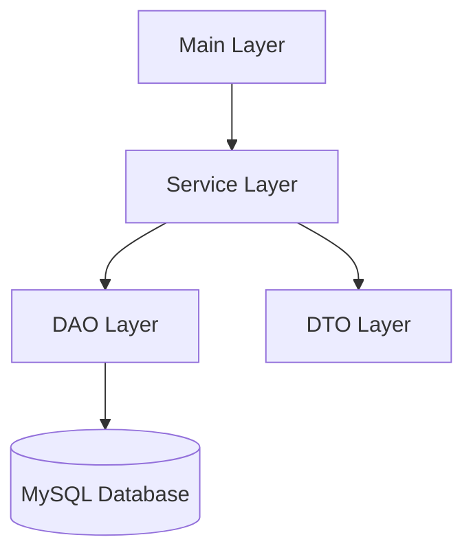

# 🍽️ Canteen Management System

A **menu-driven Command Line Interface (CLI)** application developed using **Core Java, JDBC, and MySQL** to efficiently manage canteen food items and customer orders.

---

## 📌 Project Title
**Canteen Management System using Core Java, JDBC, and MySQL**

---

## 📖 Project Description

The **Canteen Management System** is a console-based Java application that automates basic canteen operations such as managing food items and processing customer orders.

The system uses **JDBC** for database connectivity and **MySQL** for persistent data storage.  
It follows a **layered architecture**, ensuring clean separation of concerns, better scalability, and easy maintenance.

---

## 🎯 Objectives

- Implement JDBC connectivity with MySQL  
- Perform CRUD (Create, Read, Update, Delete) operations  
- Understand and apply layered architecture  
- Develop a real-world Java application  

---

## 🛠️ Technologies Used

| Technology | Description |
|----------|------------|
| **Java** | Core application logic |
| **JDBC** | Database connectivity |
| **MySQL** | Data storage |
| **CLI** | User interaction |

---

## 🧱 System Architecture

### Architecture Layers
- **DTO Layer** – Transfers data between layers  
- **DAO Layer** – Handles database operations  
- **Service Layer** – Contains business logic  
- **Main Layer** – Handles user interaction  

### Architecture Diagram



---

## 🗂️ Code Structure

```text
CanteenManagementSystem/
│
├── src/
│   ├── controller/
│   │   └── CanteenApp.java
│   │
│   ├── service/
│   │   ├── FoodService.java
│   │   └── OrderService.java
│   │
│   ├── dao/
│   │   ├── FoodDAO.java
│   │   └── OrderDAO.java
│   │
│   ├── dto/
│   │   ├── FoodItem.java
│   │   └── Order.java
│   │
│   └── util/
│       └── DBConnection.java
│
└── README.md
```

---

## ⚙️ Functional Modules

- ➕ Add Food Item  
- 📋 View Food Menu  
- 🛒 Place Order  
- 📦 View Orders  
- ❌ Delete Food Item  

---

## ▶️ How to Run the Project

1. Install **Java (JDK 8+)**
2. Install **MySQL Server**
3. Create the database using the SQL schema
4. Update credentials in `DBConnection.java`
5. Compile and run `CanteenApp.java`
6. Use the CLI menu

---

## 🧠 Learning Outcomes

- JDBC programming skills  
- MySQL database handling  
- Layered architecture understanding  
- Java CLI application development  

---

## 🔮 Future Enhancements

- Login system (Admin / User)
- Bill generation
- Sales reports
- GUI using JavaFX or Swing

---

## ✅ Conclusion

The **Canteen Management System** demonstrates the effective use of **Core Java, JDBC, and MySQL** to build a structured, secure, and real-world application.
